Homework 01
================
Konrat Pekkip

## Question 1: Reverse-Engineering the Grammar of Graphics

**Data**: The data underlying this graph comes from [“The Covid Tracking
Project”](https://covidtracking.com/).

**Aesthetics**: The creators of the graph map the following aesthetics
to the data: Percent change in the 7-day average of tests administered
(mapped to the y-axis, indicated by the color green), and percent change
in the 7-day average of new COVID infections recorded (mapped to the
y-axis, indicated by the color orange[^1]), both of which are relative
to the starting value from June 1st, 2020. A third aesthetic mapped to
the data is time (mapped to the x-axis), namely the time period between
June 1st, 2020 and July 5th, 2020.

**Geometries**: The creators of the graph utilize line graphs to
visualize the trends in the dataset. Moreover, they highlight the
differences between the two variables mapped to the y-axis, number of
tests administered and cases recorded, by shading the area between the
two lines.

**Facets**: The authors analyze the data not for the whole United
States, but faceted by states, allowing for comparisons between every
state (except Vermont and Hawai’i). Moreover, the graph is split in two
groups, one of which consists of the 28 states with higher numbers of
new cases than testing, the other consisting of the 21 states with
higher numbers of tests than new cases.

**Statistics**: The authors chose to include in the graph the percentage
changes in numbers for both the number of new cases as well as the
number of tests administered. This is particularly helpful because they
do not include the x and y axes (and corresponding values) in the
visualization.

**Coordinates**: The authors chose not to include x or y axes in the
visualization of the dataset, and do not provide another coordinate
system in the visualization of the data.

**Theme**: The authors chose to visualize the data using a very
simplistic theme that does not include a coordinate system (as mentioned
before) or a grid that would help us better understand trends in the
data.

## Question 2: Road traffic accidents in Edinburgh

``` r
#recreate plot indicating number of accidents during the day
accidents %>%
  mutate(weekend = ifelse(day_of_week == "Saturday" | day_of_week == "Sunday", "Weekend", "Weekday")) %>%
  ggplot(mapping = aes(x = time, fill = severity))+
  geom_density(alpha = 0.5)+
  scale_fill_viridis_d(name = "Severity")+
  facet_wrap(vars(weekend), ncol = 1)+
  theme_minimal()+
  labs(title = "Number of accidents throughout the day",
       subtitle = "By day of week and severity",
       y = "Density",
       x = "Time of Day")
```

<!-- -->

The above plot displays the density of accidents that occur in Edinburgh
in 2018 both on weekdays and on weekends. The timing and density of
slight accidents appears similar on weekends and weekdays, peaking
around or a little after 4pm. Similarly, serious accidents appear to
peak in the afternoon both on weekends and weekdays. Fatal accidents are
only reported to occur on weekdays and not weekends, which is surprising
given people’s alcohol consumptions on weekends which one could expect
to lead to higher numbers of fatal accidents. On weekdays, fatal
accidents appear to peak a little before noon, and the number of fatal
incidents that occur at night appears higher than those occurring in the
afternoon.

## Question 3: NYC marathon winners

``` r
#create histogram of the distribution of marathon times
ggplot(data = nyc_marathon,
       mapping = aes(y = time_hrs))+
  geom_histogram(binwidth = 0.03, na.rm = TRUE, fill = "navy")+
  theme_minimal()+
  labs(title = "Distribution of Finishing Times of NYC Marathon Winners",
       "Includes data from NYC Marathons between 1970-2020",
       y = "Marathon Completion Time in Hours",
       x = "Number of Winners Finishing per Completion Time",
       caption = "Source: OpenIntro Package")
```

<!-- -->

``` r
#create box plot of the distribution of marathon times
ggplot(data = nyc_marathon,
       mapping = aes(y = time_hrs))+
  geom_boxplot(na.rm = TRUE, color = "navy")+
  theme_minimal()+
  theme(axis.text.x=element_blank())+
  labs(title = "Distribution of Finishing Times of NYC Marathon Winners",
       subtitle = "Includes data from NYC Marathons between 1970-2020",
       y = "Marathon Completion Time in Hours",
       caption = "Source: OpenIntro Package")
```

<!-- -->

The above histogram and box plots show us the distribution of finishing
times of NYC Marathon winners between 1970 and 2020. The box plot
indicates that the interquartile range of these finishing times is
between a little over 2.125 and a little under 2.5, with the median
finishing time being roughly 2.375 hours. We can also see that there are
four outliers in the data, all of which Marathon winners that won with
relatively slow times. Neither the median nor the interquartile range
are apparent in the histogram. However, the histogram potentially
indicates the mode of the data, though no conclusive statements can be
made about the mode as the visualization of it depends on the bin width
which is chosen arbitrarily. The histogram also provides more insights
into the distribution of values within the interquartile range; for
example, we can tell that the distribution of winning times is bimodal
(perhaps due to gender?). The box plot does not provide us with those
same insights into the data structure.

``` r
#create side by side box plots of finishing time by gender
ggplot(data = nyc_marathon,
       mapping = aes(y = time_hrs, color = division))+
  scale_color_manual(values = c("magenta", "cyan"))+
  geom_boxplot(na.rm = TRUE, show.legend = FALSE)+
  facet_wrap(vars(division))+
  theme_minimal()+
  theme(axis.text.x=element_blank())+
  labs(title = "Distribution of Finishing Times of NYC Marathon Winners by Gender",
       subtitle = "Includes data from NYC Marathons between 1970-2020",
       y = "Marathon Completion Time in Hours",
       x = "Gender",
       caption = "Source: OpenIntro Package")
```

<!-- -->

Comparing the completion times of female (cyan-colored) and male
(magenta-colored) NYC Marathon winners, one can see that men tend to
have lower completion times and run the Marathon quicker than women,
indicated by the lower median and interquartile range. However, there
are a few outliers among the male runners who appear to have finished
the race at a similar or slower time to the median of female Marathon
winners. In comparison to the box plot constructed in exercise 3a, the
box plots divided by gender reveal more outliers.

``` r
#redo previous plot without faceting
ggplot(data = nyc_marathon,
       mapping = aes(y = time_hrs, color = division))+
  scale_color_manual(values = c("magenta", "cyan"))+
  geom_boxplot(na.rm = TRUE)+
  theme_minimal()+
  theme(axis.text.x=element_blank())+
  labs(title = "Distribution of Finishing Times of NYC Marathon Winners by Gender",
       subtitle = "Includes data from NYC Marathons between 1970-2020",
       y = "Marathon Completion Time in Hours",
       x = "Gender",
       color = "Gender",
       caption = "Source: OpenIntro Package")
```

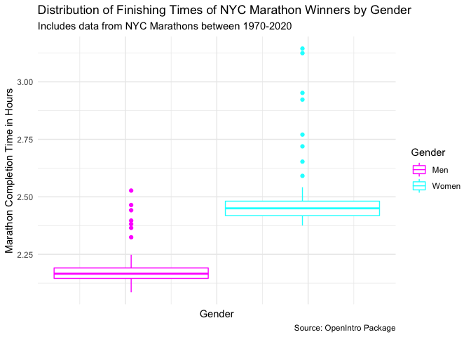<!-- -->

``` r
#redo previous plot without color differences
ggplot(data = nyc_marathon,
       mapping = aes(y = time_hrs))+
  geom_boxplot(na.rm = TRUE, show.legend = FALSE)+
  facet_wrap(vars(division))+
  theme_minimal()+
  theme(axis.text.x=element_blank())+
  labs(title = "Distribution of Finishing Times of NYC Marathon Winners by Gender",
       subtitle = "Includes data from NYC Marathons between 1970-2020",
       y = "Marathon Completion Time in Hours",
       x = "Gender",
       caption = "Source: OpenIntro Package")
```

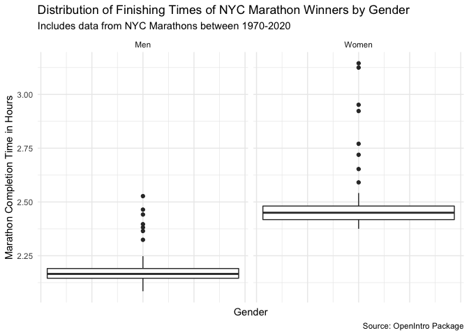<!-- -->

I don’t think very many things in the plot from exercise 3b were
redundant. The only thing that I noticed is redundant is that I
assigning a different color for the different genders *and* made use of
faceting to work out the same difference. In the first plot above, I
thus redid the same graph but this time without faceting, as the color
difference already indicates the gender division. Alternatively, one
could facet the plot without using color, which is what I do for the
second plot. Neither graph meaningfully changes the data-to-ink ration
in my opinion.

``` r
ggplot(data = nyc_marathon,
       mapping = aes(x = year, y = time_hrs, color = division, shape = division))+
  scale_color_manual(values = c("magenta", "cyan"), name = "Gender")+
  scale_shape_manual(values = c(16, 17), name = "Gender")+
  geom_point(na.rm = TRUE)+
  theme_minimal()+
  labs(title = "Finishing Times of NYC Marathon Winners by Year and Gender",
       subtitle = "Includes data from NYC Marathons between 1970-2020",
       x = "Year",
       y = "Marathon Completion Time in Hours",
       caption = "Source: OpenIntro Package")
```

<!-- -->

This plot is the first one that allows us to better understand the
changes in completion times by gender *and* over the years. We can see
that every year, the male winner of the NYC marathon reached the finish
line before the female winner of that year. Moreover, we can see that in
some years, both the male and female winner finished quicker and in
others, both finished slower. This might indicate that performance
depends on situational factors that differ by year (e.g. different
weather). We can also see that starting in the first few years, i.e. the
early 1970s, both men and women performed worse in the Marathon.
Starting in the mid-1970s, the completion times appear to stabilize for
both men and women. This might be due to technological advances
(e.g. new shoe technology) that both male and female participants
benefited starting in the mid-1970s.

## Question 4: US counties

``` r
#examine code from exercise 4a
ggplot(county) +
  #geom_point(aes(x = median_edu, y = median_hh_income)) +
  geom_boxplot(aes(x = smoking_ban, y = pop2017))
```

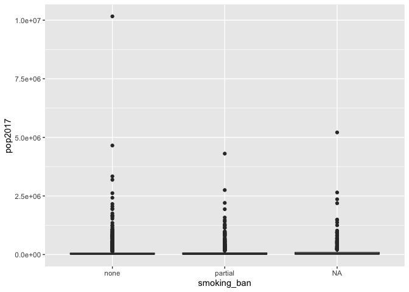<!-- -->

The code above works in the sense that it produces an output. However,
assuming the intention was to create a plot showcasing the relationship
between median education level and median household income on one hand,
and a box plot indicating the distribution of the population in 2017 by
counties with comprehensive, partial or no smoking bans, I believe the
above code does not achieve that.

First of all, I think the coder should have created two separate
ggplots, as there is no overlap between variables between the two plots
they attempted to create. Secondly, to analyze the relationship between
a categorical and a continuous variable (i.e. median education level and
median household income), a scatter plot is not the way to go. Instead,
the coder could have utilized a box plot to indicate the distribution of
household income per education level, or a violin plot in order to
indicate the density of observations by income level.

Considering the second plot the coder attempted to create, formally, a
box plot is an appropriate way of going about it, as it maps the
distribution of a continuous variable (i.e. population in 2017) onto a
categorical variable (i.e. smoking ban). However, in this context, I’m
not sure what the contribution is, as the two variables do not seem
related to me.

``` r
#recreate plot A from exercise 4b
ggplot(data = county,
       mapping = aes(x = homeownership, y = poverty))+
  geom_point()+
  labs(title = "Plot A")
```

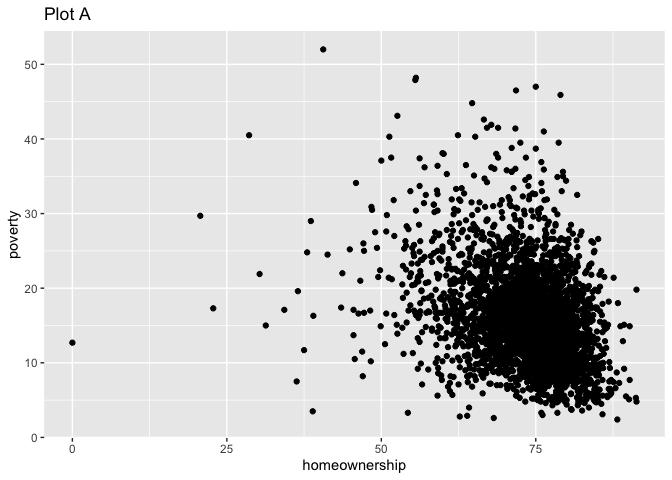<!-- -->

``` r
#recreate plot B from exercise 4b
ggplot(data = county,
       mapping = aes(x = homeownership, y = poverty))+
  geom_point()+
  geom_smooth(se = FALSE,
              method = 'gam',
              formula = y ~ s(x, bs = "cs"))+
  labs(title = "Plot B")
```

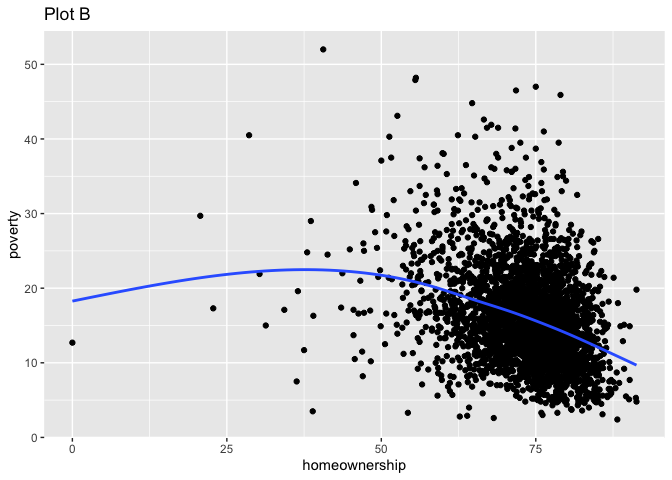<!-- -->

``` r
#recreate plot C from exercise 4b
ggplot(data = county,
       mapping = aes(x = homeownership, y = poverty))+
  geom_point(color = "black")+
  geom_smooth(mapping = aes(group = metro),
              se = FALSE,
              color = "green",
              method = 'gam',
              formula = y ~ s(x, bs = "cs"))+
  labs(title = "Plot C")
```

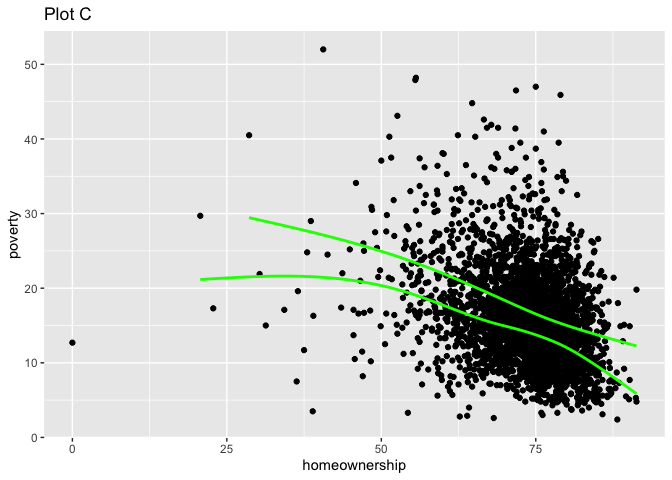<!-- -->

``` r
#recreate plot D from exercise 4b
ggplot(data = county,
       mapping = aes(x = homeownership, y = poverty))+
  geom_point(color = "black")+
  geom_smooth(mapping = aes(group = metro),
              se = FALSE,
              color = "blue",
              method = 'gam',
              formula = y ~ s(x, bs = "cs"))+
  labs(title = "Plot D")
```

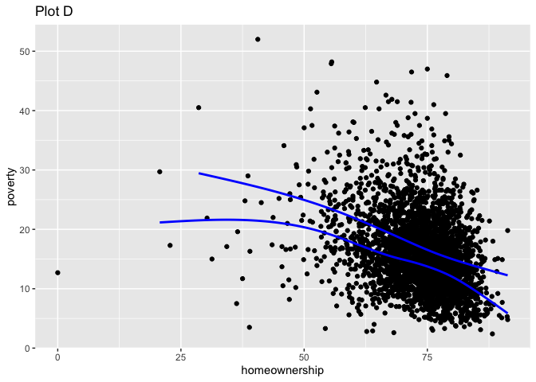<!-- -->

``` r
#recreate plot E from exercise 4b
ggplot(data = county,
       mapping = aes(x = homeownership, y = poverty, color = metro))+
  geom_point()+
  geom_smooth(mapping = aes(linetype = metro),
              se = FALSE,
              color = "blue",
              method = 'gam',
              formula = y ~ s(x, bs = "cs"))+
  labs(title = "Plot E")
```

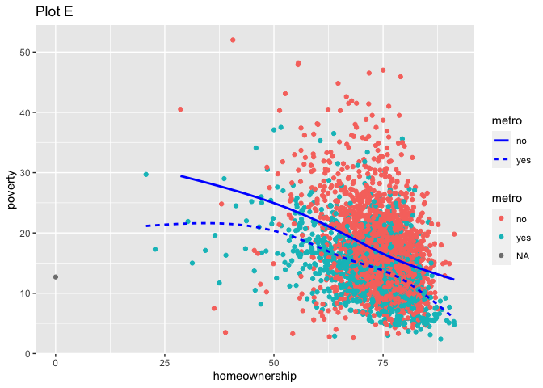<!-- -->

``` r
#recreate plot F from exercise 4b
ggplot(data = county,
       mapping = aes(x = homeownership, y = poverty, color = metro))+
  geom_point()+
  geom_smooth(se = FALSE,
              method = 'gam',
              formula = y ~ s(x, bs = "cs"))+
  labs(title = "Plot F")
```

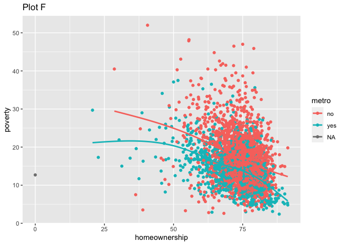<!-- -->

``` r
#recreate plot G from exercise 4b
ggplot(data = county,
       mapping = aes(x = homeownership, y = poverty, color = metro))+
  geom_point()+
  geom_smooth(mapping = aes(group = 1),
              se = FALSE,
              method = 'gam',
              formula = y ~ s(x, bs = "cs"))+
  labs(title = "Plot G")
```

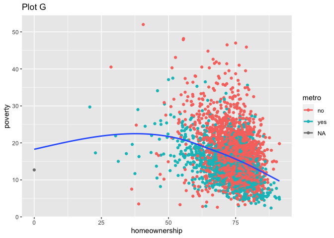<!-- -->

``` r
#recreate plot H from exercise 4b
ggplot(data = county,
       mapping = aes(x = homeownership, y = poverty, color = metro))+
  geom_point()+
  labs(title = "Plot H")
```

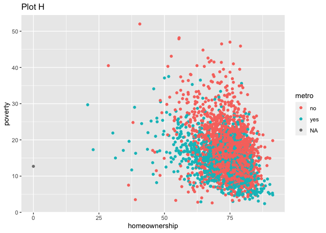<!-- -->

## Question 5: Napoleon’s march.

[^1]: I’m not sure if this is accurate as I’m partially colorblind.
