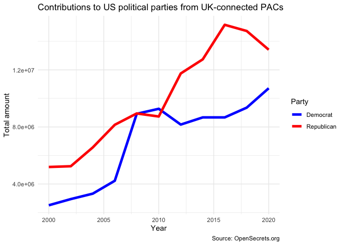

Homework 02
================
Konrat Pekkip

1.  **A new day, a new plot, a new geom.**

``` r
#create ridge density plot of airbnb review scores by neighorhood
edibnb %>%
  group_by(neighbourhood) %>%
  mutate(median_review = median(review_scores_rating, na.rm = TRUE)) %>%
  ungroup() %>%
  mutate(neighbourhood = fct_reorder(.f = neighbourhood, .x = median_review, .fun = median)) %>%
  ggplot(data = subset(., !is.na(neighbourhood)),
         mapping = aes(x = review_scores_rating, 
                       y = neighbourhood,
                       fill = neighbourhood))+
  geom_density_ridges(na.rm = TRUE,
                      quantile_lines=TRUE,
                      quantile_fun=function(x,...)median(x),
                      show.legend = FALSE)+
  theme_minimal()+
  labs(title = "Distribution of AirBnB Review Scores by Neighborhood of Edinburgh",
       subtitle = "In Descending Order Based on Median Review Score",
       x = "Density of AirBnB Review Scores",
       y = "Neighborhood",
       caption = "Source: dsbox Package in R")
```

    ## Picking joint bandwidth of 1.23

<!-- -->

The above plot showcases the distribution and density of AirBnb review
scores by neighborhood for the city of Edinburgh in Scotland. The
vertical lines indicate the median review score of AirBnBs in a given
neighborhood, by which the neighborhoods are also sorted along the y
axis. Morningside and Bruntsfield appear to be the neighborhoods with
the most popular median AirBnB offerings, as their median ratings are
the highest. The distribution of AirBnB reviews appears to differ by
neighborhood as well; some neighborhoods (e.g. Tollcross and Southside)
have a greater left-skewed tail of the distribution, indicating a
greater propensity towards (relatively) lower review scores. Overall, I
think the distribution of AirBnb review scores is rather similar across
neighborhoods, which might indicate that there is not much of a
qualitative difference in AirBnB offerings by neighborhood of Edinburgh.
It would be interesting to compare Edinburgh to other cities like
Glasgow or Dundee to get a better understanding whether this is a
broader trend across Scottish cities, or specific to Edinburgh.

2.  **Key lyme pie.**

``` r
#create data frame

#create pie chart

#present information as bar graph
```

3.  **Foreign Connected PACs.**

``` r
# get a list of files with "Foreign Connected PAC" in their names
list_of_files <- dir_ls(path = "data", regexp = "Foreign Connected PAC")

# read all files and row bind them
# keeping track of the file name in a new column called year
pac <- read_csv(list_of_files, id = "year")
```

    ## Rows: 2184 Columns: 6
    ## ── Column specification ────────────────────────────────────────────────────────
    ## Delimiter: ","
    ## chr (5): PAC Name (Affiliate), Country of Origin/Parent Company, Total, Dems...
    ## 
    ## ℹ Use `spec()` to retrieve the full column specification for this data.
    ## ℹ Specify the column types or set `show_col_types = FALSE` to quiet this message.

``` r
#clean data and pivot_longer the dems/repubs variables
pac2 <- pac %>%
  clean_names() %>%
  separate(col = country_of_origin_parent_company,
           into = c("country_of_origin", "parent_company"),
           sep = '/') %>%
  separate(col = year,
           into = c("remove","year"),
           sep = "-") %>%
  select(-remove) %>%
  mutate(year = as.numeric(str_remove(string = year,
                           pattern = ".csv"))) %>%
  pivot_longer(cols = c("dems", "repubs"),
               names_to = "party",
               values_to = "contribution_amount") %>%
  mutate(contribution_amount = as.numeric(str_remove(string = contribution_amount,
                                                     pattern = "\\$")),
         total = as.numeric(str_remove(string = total,
                                       pattern = "\\$")))
```

    ## Warning: Expected 2 pieces. Additional pieces discarded in 16 rows [125, 349,
    ## 552, 732, 910, 930, 1124, 1149, 1357, 1386, 1595, 1623, 1845, 1874, 2083, 2106].

``` r
test <- pac2 %>%
  group_by(year, party) %>%
  summarize(totalsum = sum(contribution_amount))
```

    ## `summarise()` has grouped output by 'year'. You can override using the
    ## `.groups` argument.

``` r
#recreate visualization
test %>%
  group_by(party) %>%
  ggplot(mapping = aes(x = year, y = totalsum, color = party), na.rm = TRUE)+
  geom_line(size = 1.75)+
  scale_color_manual(values = c("blue", "red"))+
  theme_minimal()+
  labs(title = "Contributions to US political parties from UK-connected PACs",
       x = "Year",
       y = "Total amount",
       caption = "Source: OpenSecrets.org")
```

<!-- -->

4.  **Hop on.**
