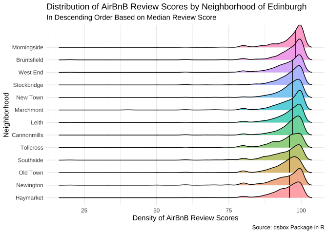

Homework 02
================
Konrat Pekkip

1.  **A new day, a new plot, a new geom.**

``` r
#create ridge density plot of airbnb review scores by neighorhood
edibnb %>%
  group_by(neighbourhood) %>%
  mutate(median_review = median(review_scores_rating, na.rm = TRUE)) %>%
  ungroup() %>%
  mutate(neighbourhood = fct_reorder(.f = neighbourhood, .x = median_review)) %>%
  ggplot(data = subset(., !is.na(neighbourhood)),
         mapping = aes(x = review_scores_rating, 
                       y = neighbourhood,
                       fill = neighbourhood))+
  geom_density_ridges(na.rm = TRUE,
                      quantile_lines=TRUE,
                      quantile_fun=function(x,...)median(x),
                      show.legend = FALSE)+
  theme_minimal()+
  labs(title = "Distribution of AirBnB Review Scores by Neighborhood of Edinburgh",
       subtitle = "In Descending Order Based on Median Review Score",
       x = "Density of AirBnB Review Scores",
       y = "Neighborhood",
       caption = "Source: dsbox Package in R")
```

    ## Picking joint bandwidth of 1.23

<!-- -->

The above plot showcases the distribution and density of AirBnb review
scores by neighborhood for the city of Edinburgh in Scotland. The
vertical lines indicate the median review score of AirBnBs in a given
neighborhood, by which the neighborhoods are also sorted along the y
axis. Morningside and Bruntsfield appear to be the neighborhoods with
the most popular median AirBnB offerings, as their median ratings are
the highest. The distribution of AirBnB reviews appears to differ by
neighborhood as well; some neighborhoods (e.g. Tollcross and Southside)
have a greater left-skewed tail of the distribution, indicating a
greater propensity towards (relatively) lower review scores. Overall, I
think the distribution of AirBnb review scores is rather similar across
neighborhoods, which might indicate that there is not much of a
qualitative difference in AirBnB offerings by neighborhood of Edinburgh.
It would be interesting to compare Edinburgh to other cities like
Glasgow or Dundee to get a better understanding whether this is a
broader trend across Scottish cities, or specific to Edinburgh.

2.  **Key lyme pie.**

``` r
#create data frame

#create pie chart

#present information as bar graph
```

3.  **Foreign Connected PACs.**

``` r
#recreate visualization for contributions from UK companies
cleaned_pac %>%
  filter(country_of_origin == "UK") %>%
  group_by(year, party) %>%
  summarize(totalsum = sum(contribution_amount)) %>%
  mutate(party = ifelse(party == "dems", "Democrat", "Republican"))  %>%
  ungroup() %>%
  group_by(party) %>%
  ggplot(mapping = aes(x = year, y = totalsum, color = party), na.rm = TRUE) +
  geom_line(size = 1.5) +
  scale_color_manual(values = c("blue", "red")) +
  scale_x_continuous(name = "Year", 
                     breaks = seq(2000, 2020, 4)) +
  scale_y_continuous(name = "Total Amount",
                     labels = label_number(prefix = "$",
                                           suffix = "M", 
                                           scale = 1e-6)) +
  theme_minimal() +
  theme(axis.title.y = element_text(hjust = 0),
        axis.title.x = element_text(hjust = 0),
        legend.justification=c(1,0), 
        legend.position=c(1,0)) +
  labs(title = "Contributions to US political parties from UK-connected PACs",
       color = "Party",
       caption = "Source: OpenSecrets.org")
```

    ## `summarise()` has grouped output by 'year'. You can override using the
    ## `.groups` argument.

<!-- -->

``` r
#create similar visualization for contributions from another country (Germany)
cleaned_pac %>%
  filter(country_of_origin == "Germany") %>%
  group_by(year, party) %>%
  summarize(totalsum = sum(contribution_amount)) %>%
  mutate(party = ifelse(party == "dems", "Democrat", "Republican"))  %>%
  ungroup() %>%
  group_by(party) %>%
  ggplot(mapping = aes(x = year, y = totalsum, color = party), na.rm = TRUE) +
  geom_line(size = 1.5) +
  scale_color_manual(values = c("blue", "red")) +
  scale_x_continuous(name = "Year", 
                     breaks = seq(2000, 2020, 4)) +
  scale_y_continuous(name = "Total Amount",
                     labels = label_number(prefix = "$",
                                           suffix = "M", 
                                           scale = 1e-6)) +
  theme_minimal() +
  theme(axis.title.y = element_text(hjust = 0),
        axis.title.x = element_text(hjust = 0),
        legend.justification=c(1,0), 
        legend.position=c(1,0)) +
  labs(title = "Contributions to US political parties from Germany-connected PACs",
       color = "Party",
       caption = "Source: OpenSecrets.org")
```

    ## `summarise()` has grouped output by 'year'. You can override using the
    ## `.groups` argument.

<!-- -->

The above visualizations showcase the amount of contributions, in
dolllars, that companies from the United Kingdom and Germany have issued
to the two major American political parties, the Democrats and the
Republicans. Companies from both countries appear to support the
Republican party more so than the Democratic party, perhaps due to the
Republicans’ laissez-faire approach to regulating (big) corporations. We
can also see that for companies from both the UK and Germany, the amount
of money donated to American parties has increased over time, albeit
with ups and downs. Perhaps this is related to court rulings like
*Citizens United vs FEC* that make it easier for companies to donate
money to political parties in the US.

Whereas to a degree in the UK, and more so in Germany, recent
governments have been closer, both ideologically and policy-wise, to the
Democratic party than the Republicans, the same does not appear to hold
true for companies based in these countries. However, this might have
changed during the Trump administration: we can see that both companies
in the United Kingdom and companies in Germany increased their
contributions to the Democratic party leading up to the critical 2020
Presidential election whereas their contributions to the GOP decreased.
Perhaps corporations in both countries were worried about increasing
political instability in the United States to the degree where these
concerns outweighed the economic benefits that came with supporting the
Republican party. It might also be due to the tariffs the Trump
administration placed on foreign companies during the trade war with the
European Union. Perhaps foreign corporations tend to simply support the
party they view most likely not to support a protectionist approach to
economic policy.

4.  **Hop on.**
