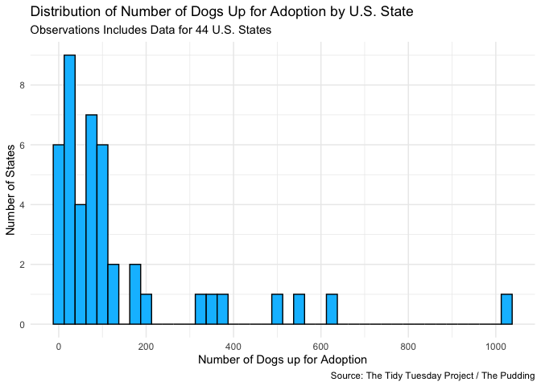
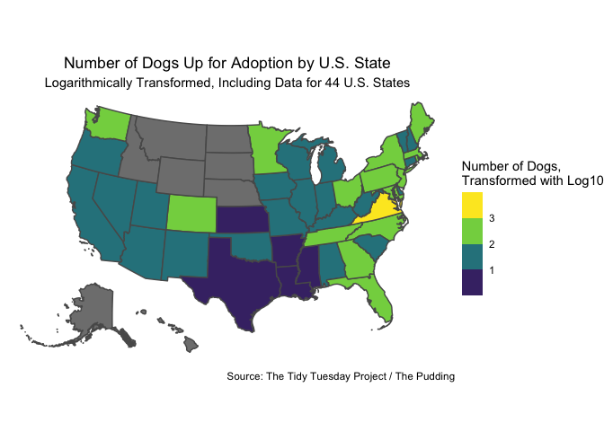
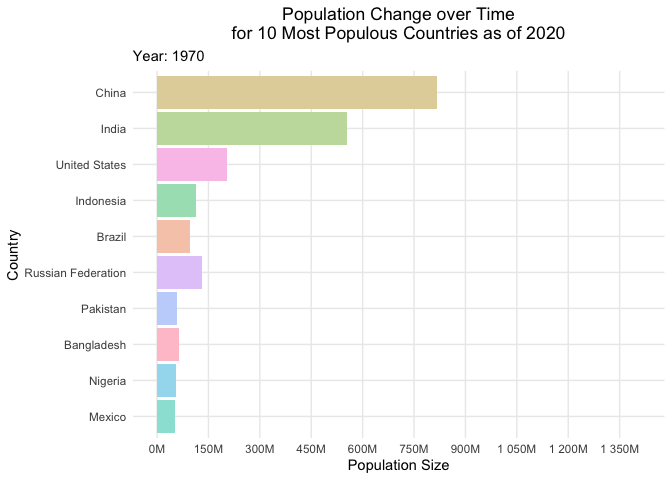
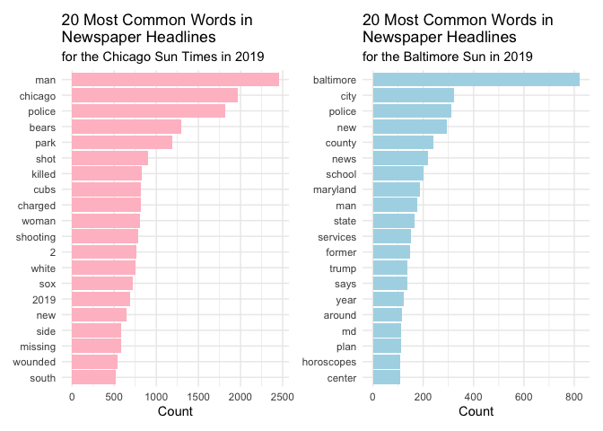
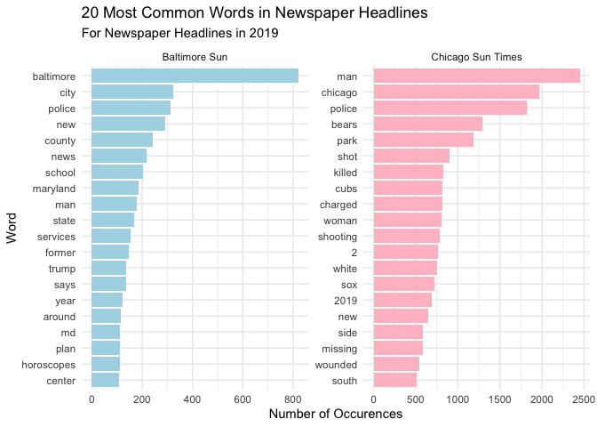
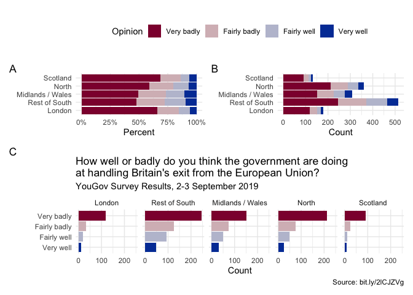

Homework 03
================
Konrat Pekkip

## Questions

For question 1, how do you set the sequences/breaks for the x axis based
on values in the data? e.g. sequence between xmin and xmax by arbitrary
number?

For question 1 map part, I get the following error: “old-style crs
object detected; please recreate object with a recent sf::st_crs()” – Is
that ok?

For question 2, can you switch between M and T suffix once specific
number is reached?

For question 2, how do you do smoother transitions and longer pause in
the end?

For question 3, why does faceted plot not order words in descending
order?

for question 3, is there a way to reorder facets?

Why does the document not knit?

``` r
#load required packages
library(tidyverse)
library(sf)
library(ggmap)
library(geofacet)
library(urbnmapr)
library(colorspace)
library(gganimate)
library(scales)
library(tidytext)
library(knitr)
library(patchwork)
```

1.  **Adopt, don’t shop.**

``` r
#read data
dogs <- read_csv("data/dog_travel.csv")
```

    ## Rows: 6194 Columns: 8
    ## ── Column specification ────────────────────────────────────────────────────────
    ## Delimiter: ","
    ## chr (5): contact_city, contact_state, description, found, manual
    ## dbl (1): id
    ## lgl (2): remove, still_there
    ## 
    ## ℹ Use `spec()` to retrieve the full column specification for this data.
    ## ℹ Specify the column types or set `show_col_types = FALSE` to quiet this message.

``` r
#calculate number of dogs available for adoption per state
dogs_count <- dogs %>%
  filter(contact_state != "17325") %>%
  group_by(contact_state) %>%
  summarize(count = n())

#create histogram showing the distribution of dogs up for adoption by state
ggplot(data = dogs_count,
       mapping = aes(x = count)) +
  geom_histogram(binwidth = 25, fill = "deepskyblue", color = "black") +
  theme_minimal() +
  scale_y_continuous(breaks = seq(0, 10, by = 2)) +
  scale_x_continuous(breaks = seq(0, 1000, by = 200)) +
  labs(title = "Distribution of Number of Dogs Up for Adoption by U.S. State",
       subtitle = "Observations Includes Data for 44 U.S. States",
       x = "Number of Dogs up for Adoption",
       y = "Number of States",
       caption = "Source: The Tidy Tuesday Project / The Pudding")
```

<!-- -->

Based on the histogram printed above, one can see that in a majority of
states, less than 200 dogs were up for adoption, and a significant
number of states had less than 100 dogs up for adoption. There is one
outlier state that stands out in particular, at over 1000 dogs up for
adoption. Overall, the distribution appears right-skewed, indicating
that the median number of dogs up for adoption is lesser than the mean
number of dogs up for adoption.

``` r
#load geometric data corresponding with US states for mapping purposes
states_sf <- get_urbn_map("states", sf = TRUE)

#rename state variable in dogs dataset
dogs_map <- dogs_count %>%
  rename(state_abbv = contact_state)

#merge dogs dataset and states geometry dataset
dogs_states <- full_join(dogs_map, states_sf, by = "state_abbv")
```

    ## old-style crs object detected; please recreate object with a recent sf::st_crs()

``` r
#create a map indicating number of dogs available for adoption per state
ggplot(data = dogs_states) +
  geom_sf(mapping = aes(fill= log10(count), geometry = geometry)) +
  theme_void() +
  theme(axis.text = element_blank(),
        plot.title = element_text(hjust = 0.5),
        plot.subtitle = element_text(hjust = 0.5)) +
  scale_fill_viridis_b() +
  labs(title = "Number of Dogs Up for Adoption by U.S. State",
       subtitle = "Logarithmically Transformed, Including Data for 44 U.S. States",
       caption = "Source: The Tidy Tuesday Project / The Pudding",
       fill = "Number of Dogs,\nTransformed with Log10")
```

<!-- -->

The map above indicates the number of dogs up for adoption by U.S.
state, logarithmically transformed. One can discern some regional
patterns: It appears as though many East Coast states have higher
numbers of dogs up for adoption, while states on the West Coast boast
lower numbers. The states with the least dogs up for adoption appear to
be in the U.S. South, specifically Texas and its neighbors to the East,
as well as Kansas. The state with the highest number of dogs up for
adoption is Virginia. Finally, there is a range of states that do not
have any reported data on the matter, most of which are clustered in the
Pacific Northwest of the country, as well as Alaska and Hawai’i.

2.  **Country populations**

``` r
#load data
population <- read_csv("data/country-pop.csv")
```

    ## Rows: 11067 Columns: 9
    ## ── Column specification ────────────────────────────────────────────────────────
    ## Delimiter: ","
    ## chr  (4): iso2c, iso3c, country, footnote
    ## dbl  (2): date, SP.POP.TOTL
    ## lgl  (2): unit, obs_status
    ## date (1): last_updated
    ## 
    ## ℹ Use `spec()` to retrieve the full column specification for this data.
    ## ℹ Specify the column types or set `show_col_types = FALSE` to quiet this message.

``` r
#identify and subset data for countries with the top-10 highest population count in 2020
top_pop_2020 <- population %>%
  filter(date == 2020) %>%
  arrange(desc(SP.POP.TOTL)) %>%
  slice(1:10)

pop_subset <- population %>%
  filter(iso3c %in% top_pop_2020$iso3c) %>%
  group_by(date) %>%
  mutate(ranked_pop = rank(-SP.POP.TOTL, ties.method = "first"))

#create static bar chart with facets for each year
pop_static <- ggplot(data = pop_subset,
       mapping = aes(y = fct_reorder(as.factor(ranked_pop), SP.POP.TOTL, .desc = FALSE), x = SP.POP.TOTL, fill = country)) + 
  geom_col(show.legend = FALSE) + 
  geom_text(
    hjust = "right",
    aes(label = country),
    x = -10000000
  ) +
  facet_wrap(vars(date)) +
  theme_minimal() +
  theme(plot.title = element_text(hjust = 0.5),
        plot.subtitle = element_text(hjust = 0.25),
        panel.grid.minor = element_blank(),
        panel.grid.major.y = element_blank(),
        axis.text.y = element_blank()) +
  aes(group = country) +
  scale_fill_discrete_qualitative(palette = "Pastel 1") +
  scale_x_continuous(limits = c(-500000000, 1500000000),
                     labels = label_number(suffix = "M",
                                           scale = 1e-6),
                     breaks = seq(0, 1500000000, by = 150000000))+
  labs(title = "Population Change over Time\nfor 10 Most Populous Countries as of 2020",
     subtitle = "Year: {frame_time}",
     y = "Country",
     x = "Population Size")

#animate static bar chart
pop_animated <- pop_static +
  facet_null() +
  aes(group = country) +
  transition_time(as.integer(date)) +
  labs(title = "Population Change over Time\nfor 10 Most Populous Countries as of 2020",
     subtitle = "Year: {frame_time}",
     y = "Country",
     x = "Population Size")

pop_animated
```

<!-- -->

In this racing animation, one can see that China and India have been the
most populous countries since the 1970s, with the United States in a
distant third place. One can also see tremendous population growth
throughout for almost all of these countries over time, with the
exception of Russia, where population growth, if present at all, is more
subdued.

3.  **Battle of the newspapers**

``` r
#load data
chicago <- read_csv("data/chicago_sun_times_2019.csv")
```

    ## Rows: 21735 Columns: 15
    ## ── Column specification ────────────────────────────────────────────────────────
    ## Delimiter: ","
    ## chr   (4): section, paper, author, title
    ## dbl  (10): ymd, doc_id, nword, nsentence, self_reference, accountability_wor...
    ## date  (1): date
    ## 
    ## ℹ Use `spec()` to retrieve the full column specification for this data.
    ## ℹ Specify the column types or set `show_col_types = FALSE` to quiet this message.

``` r
baltimore <- read_csv("data/baltimore_sun_2019.csv")
```

    ## Rows: 6102 Columns: 15
    ## ── Column specification ────────────────────────────────────────────────────────
    ## Delimiter: ","
    ## chr   (4): section, paper, author, title
    ## dbl  (10): ymd, doc_id, nword, nsentence, self_reference, accountability_wor...
    ## date  (1): date
    ## 
    ## ℹ Use `spec()` to retrieve the full column specification for this data.
    ## ℹ Specify the column types or set `show_col_types = FALSE` to quiet this message.

``` r
#find 20 most common words in headlines for the two newspapers
stopwords <- get_stopwords("en")

chicago_words <- unnest_tokens(tbl = chicago, output = word, input = title) %>%
  anti_join(stopwords) %>%
  count(word, sort = TRUE) %>%
  slice(1:20) %>%
  as.tibble()
```

    ## Warning: `as.tibble()` was deprecated in tibble 2.0.0.
    ## Please use `as_tibble()` instead.
    ## The signature and semantics have changed, see `?as_tibble`.
    ## This warning is displayed once every 8 hours.
    ## Call `lifecycle::last_lifecycle_warnings()` to see where this warning was generated.

    ## Joining, by = "word"

``` r
baltimore_words <- unnest_tokens(tbl = baltimore, output = word, input = title) %>%
  anti_join(stopwords) %>%
  count(word, sort = TRUE) %>%
  slice(1:20) %>%
  as.tibble()
```

    ## Joining, by = "word"

``` r
#print two tables and compare results
kable(x = chicago_words,
      col.names = c("Word", "Count"),
      caption = "20 Most Common Words in Chicago Sun Times Titles in 2019")
```

| Word     | Count |
|:---------|------:|
| man      |  2454 |
| chicago  |  1968 |
| police   |  1819 |
| bears    |  1297 |
| park     |  1188 |
| shot     |   904 |
| killed   |   824 |
| charged  |   812 |
| cubs     |   812 |
| woman    |   809 |
| shooting |   784 |
| 2        |   759 |
| white    |   753 |
| sox      |   720 |
| 2019     |   692 |
| new      |   651 |
| side     |   587 |
| missing  |   585 |
| wounded  |   540 |
| south    |   516 |

20 Most Common Words in Chicago Sun Times Titles in 2019

``` r
kable(x = baltimore_words,
      col.names = c("Word", "Count"),
      caption = "20 Most Common Words in Baltimore Sun Titles in 2019")
```

| Word       | Count |
|:-----------|------:|
| baltimore  |   821 |
| city       |   323 |
| police     |   312 |
| new        |   293 |
| county     |   242 |
| news       |   218 |
| school     |   203 |
| maryland   |   187 |
| man        |   178 |
| state      |   167 |
| services   |   153 |
| former     |   146 |
| says       |   137 |
| trump      |   137 |
| year       |   122 |
| around     |   116 |
| md         |   113 |
| plan       |   111 |
| horoscopes |   110 |
| center     |   108 |

20 Most Common Words in Baltimore Sun Titles in 2019

Comparing the 20 most common words in headlines from the Chicago Sun
Times and the Baltimore Sun in 2019, it appears as though words related
to criminal activity occur more often in the Chicago Sun Times. For
instance, the words “police”, “shot”, “killed”, “charged”, and
“shooting” are all among the 20 most used for the Chicago Sun Times,
while the only apparently crime-related words among the 20 most used
words for the Baltimore Sun is “police”. The words most commonly
occuring in headlines in the Baltimore Sun instead seem more related to
politics: for example, the words “trump”, “state”, “county”, and
“school” may all be related to political topics. Another observation is
that the Chicago Sun Times covers local sports teams as well, as
indicated by the words “bears”, “cubs”, “white”, and “sox” all showing
up among the 20 most used in headlines of the Chicago Sun Times. No
Baltimore sports team name, as far as I’m informed, shows up in the 20
most used words in headlines of the Baltimore Sun.

``` r
#barplot for chicago sun times
chicago_plot <- chicago_words %>%
  ggplot(mapping = aes(y = fct_reorder(word, n), x = n)) +
  geom_col(fill = "pink") +
  theme_minimal() +
  labs(title = "20 Most Common Words in\nNewspaper Headlines",
       subtitle = "for the Chicago Sun Times in 2019",
       x = "Count",
       y = NULL)

baltimore_plot <- baltimore_words %>%
  ggplot(mapping = aes(y = fct_reorder(word, n), x = n)) +
  geom_col(fill = "lightblue") +
  theme_minimal() +
  labs(title = "20 Most Common Words in\nNewspaper Headlines",
       subtitle = "for the Baltimore Sun in 2019",
       x = "Count",
       y = NULL)

chicago_plot + baltimore_plot
```

<!-- -->

``` r
#rowbind datasets
chicago_prebind <- chicago_words %>%
  mutate(city = "Chicago Sun Times")

baltimore_prebind <- baltimore_words %>%
  mutate(city = "Baltimore Sun")

balt_chi <- bind_rows(baltimore_prebind, chicago_prebind)

#present bar charts side by side
balt_chi %>%
  group_by(city) %>%
  ggplot(mapping = aes(y = reorder(word, n), x = n, fill = city)) +
  facet_wrap(vars(city), scales = "free") +
  scale_fill_manual(values = c("lightblue", "pink")) +
  geom_col(show.legend = FALSE) +
  theme_minimal() +
  labs(title = "20 Most Common Words in Newspaper Headlines",
       subtitle = "For Newspaper Headlines in 2019",
       x = "Number of Occurences",
       y = "Word")
```

<!-- -->

4.  **Brexit**

``` r
#load data
brexit <- read_csv("data/brexit.csv") %>%
#  filter(opinion != "Don't know") %>%
  mutate(region_name = case_when(region == "scot" ~ "Scotland",
                                 region == "north" ~ "North",
                                 region == "midlands_wales" ~ "Midlands / Wales",
                                 region == "rest_of_south" ~ "Rest of South",
                                 region == "london" ~ "London")) %>%
  mutate(opinion_score = case_when(opinion == "Very badly" ~ 1,
                                   opinion == "Faily badly" ~ 2,
                                   opinion == "Don't know" ~ 3,
                                   opinion == "Fairly well" ~ 4,
                                   opinion == "Very well" ~ 5))
```

    ## Rows: 1643 Columns: 2
    ## ── Column specification ────────────────────────────────────────────────────────
    ## Delimiter: ","
    ## chr (2): opinion, region
    ## 
    ## ℹ Use `spec()` to retrieve the full column specification for this data.
    ## ℹ Specify the column types or set `show_col_types = FALSE` to quiet this message.

``` r
#calculate variables
brexit_regions <- brexit %>%
  group_by(region_name, opinion) %>%
  summarize(count = n()) %>%
  ungroup()
```

    ## `summarise()` has grouped output by 'region_name'. You can override using the
    ## `.groups` argument.

``` r
#create percentage bar chart (A)
brexit_regions %>%
  ggplot(mapping = aes(x = count, y = region_name, fill = opinion)) +
  geom_col() +
  scale_fill_discrete_diverging(palette = "Blue-Red") +
  theme_minimal()
```

<!-- -->
