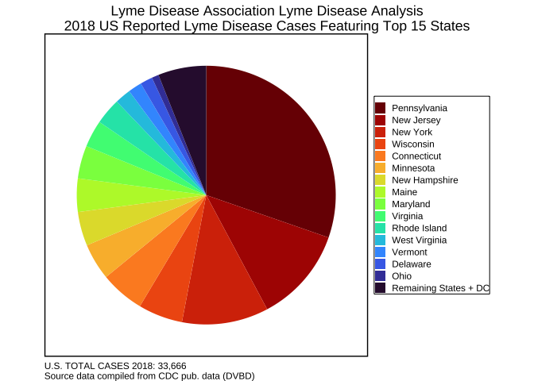
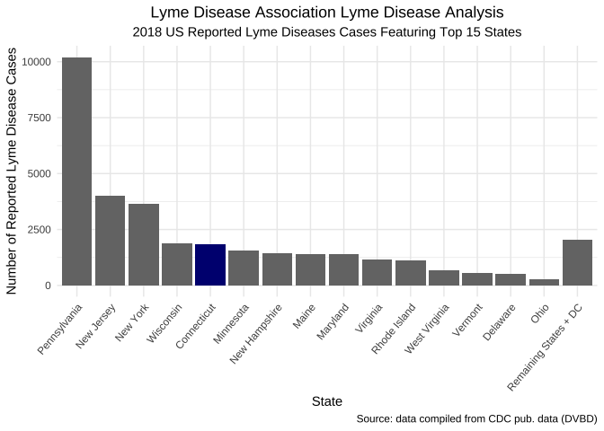
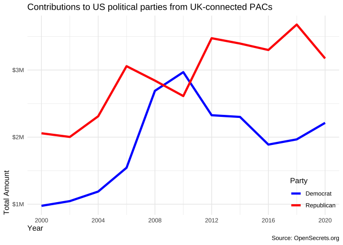
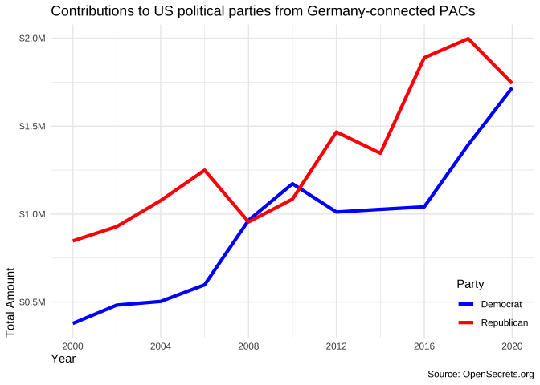
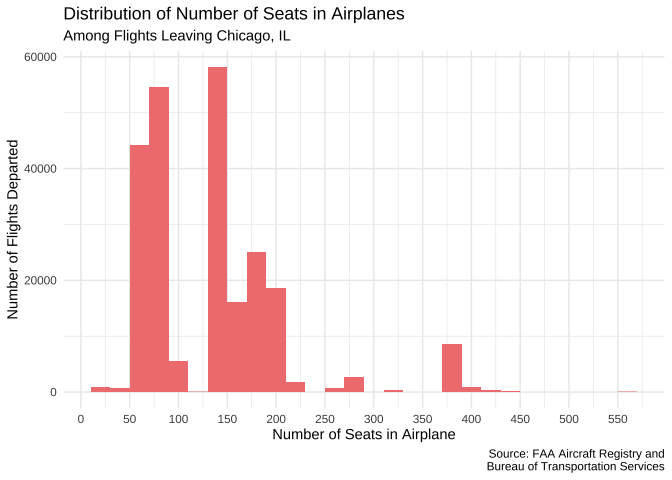
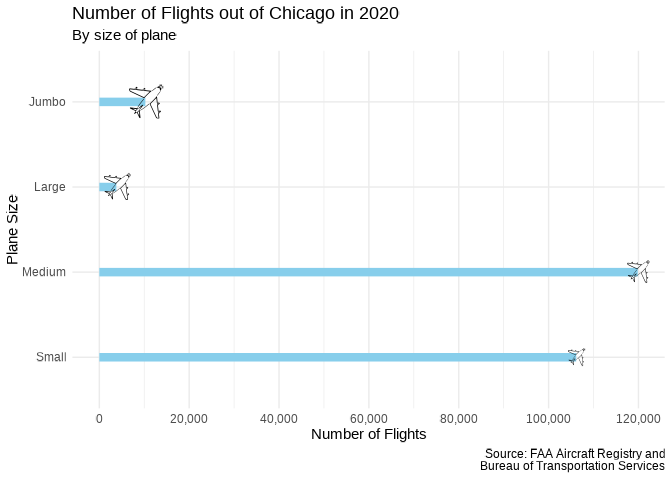
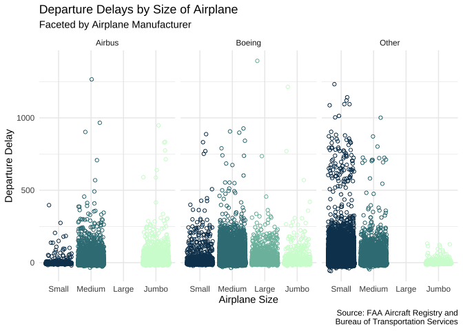

Homework 02
================
Konrat Pekkip

1.  **A new day, a new plot, a new geom.**

``` r
#create ridge density plot of airbnb review scores by neighorhood
edibnb %>%
  group_by(neighbourhood) %>%
  mutate(median_review = median(review_scores_rating, na.rm = TRUE)) %>%
  ungroup() %>%
  mutate(neighbourhood = fct_reorder(.f = neighbourhood, .x = median_review)) %>%
  ggplot(data = subset(.,
                       !is.na(neighbourhood)),
         mapping = aes(x = review_scores_rating, 
                       y = neighbourhood,
                       fill = neighbourhood)) +
  geom_density_ridges(na.rm = TRUE,
                      quantile_lines = TRUE,
                      quantile_fun = function(x,...)median(x),
                      show.legend = FALSE) +
  theme_minimal() +
  scale_fill_discrete_qualitative(palette = "Set 3") +
  labs(title = "Distribution of AirBnB Review Scores by Neighborhood of Edinburgh",
       subtitle = "In Descending Order Based on Median Review Score",
       x = "Density of AirBnB Review Scores",
       y = "Neighborhood",
       caption = "Source: dsbox Package in R")
```

    ## Picking joint bandwidth of 1.23

<!-- -->

The above plot showcases the distribution and density of AirBnb review
scores by neighborhood for the city of Edinburgh in Scotland. The
vertical lines indicate the median review score of AirBnBs in a given
neighborhood, by which the neighborhoods are also sorted along the y
axis. Morningside and Bruntsfield appear to be the neighborhoods with
the most popular median AirBnB offerings, as their median ratings are
the highest. The distribution of AirBnB reviews appears to differ by
neighborhood as well; some neighborhoods (e.g. Tollcross and Southside)
have a greater left-skewed tail of the distribution, indicating a
greater propensity towards (relatively) lower review scores. Overall, I
think the distribution of AirBnb review scores is rather similar across
neighborhoods, which might indicate that there is not much of a
qualitative difference in AirBnB offerings by neighborhood of Edinburgh.
It would be interesting to compare Edinburgh to other cities like
Glasgow or Dundee to get a better understanding whether this is a
broader trend across Scottish cities, or specific to Edinburgh.

2.  **Key lyme pie.**

``` r
#create pie chart
lyme %>%
  ggplot(mapping = aes(x = 1, 
                       y = case_count, 
                       fill = fct_relevel(fct_reorder(state, 
                                                      case_count, 
                                                      .desc = FALSE), 
                                          "Remaining States + DC", after = 0))) +
  geom_bar(stat = "identity") +
  coord_polar(theta = "y", 
              start=0) +
  labs(title = "Lyme Disease Association Lyme Disease Analysis\n2018 US Reported Lyme Disease Cases Featuring Top 15 States",
       fill = NULL,
       caption = "U.S. TOTAL CASES 2018: 33,666\nSource data compiled from CDC pub. data (DVBD)") +
  scale_fill_viridis_d(option = "turbo") +
  guides(fill = guide_legend(reverse=TRUE)) +
  theme_void() +
  theme(plot.title = element_text(hjust = 0.5),
        plot.title.position = "plot",
        legend.box.background = element_rect(colour = "black"),
        legend.key.size = unit(0.4, "cm"),
        panel.background = element_rect(fill = "white", size = 1),
        plot.caption = element_text(hjust = 0))
```

<!-- -->

``` r
#present information as bar graph
lyme %>%
  ggplot(mapping = aes(x = fct_relevel(fct_reorder(state, 
                                                   case_count, 
                                                   .desc = TRUE), 
                                       "Remaining States + DC", 
                                       after = 15), 
                       y = case_count,
                       fill = factor(ifelse(state == "Connecticut", 1, 2)))) +
  geom_col(show.legend = FALSE) +
  scale_fill_manual(values = c("navy", "gray46")) +
  theme_minimal() +
  theme(axis.text.x = element_text(angle = 50, hjust = 1),
        plot.title = element_text(hjust = 0.5),
        plot.subtitle = element_text(hjust = 0.5)) +
  labs(title = "Lyme Disease Association Lyme Disease Analysis",
       subtitle = "2018 US Reported Lyme Diseases Cases Featuring Top 15 States",
       x = "State",
       y = "Number of Reported Lyme Disease Cases",
       caption = "Source: data compiled from CDC pub. data (DVBD)")
```

<!-- -->

I decided to use color to highlight the state of Connecticut, as I think
it is a straightforward way of catching the eye of an observer. I chose
a shade of gray as the color for all other states, as gray is a rather
neutral color. I highlighted the value for Connecticut in navy, as it is
a soothing color that is not too aggressive, yet still exists in stark
contrast to the gray that is used to color the other states’ bars in
this graph.

3.  **Foreign Connected PACs.**

``` r
#recreate visualization for contributions from UK companies
cleaned_pac %>%
  filter(country_of_origin == "UK") %>%
  group_by(year, party) %>%
  summarize(totalsum = sum(contribution_amount)) %>%
  mutate(party = ifelse(party == "dems", "Democrat", "Republican"))  %>%
  ungroup() %>%
  group_by(party) %>%
  ggplot(mapping = aes(x = year, y = totalsum, color = party), na.rm = TRUE) +
  geom_line(size = 1.5) +
  scale_color_manual(values = c("blue", "red")) +
  scale_x_continuous(name = "Year", 
                     breaks = seq(2000, 2020, 4)) +
  scale_y_continuous(name = "Total Amount",
                     labels = label_number(prefix = "$",
                                           suffix = "M", 
                                           scale = 1e-6)) +
  theme_minimal() +
  theme(axis.title.y = element_text(hjust = 0),
        axis.title.x = element_text(hjust = 0),
        legend.justification=c(1,0), 
        legend.position=c(1,0)) +
  labs(title = "Contributions to US political parties from UK-connected PACs",
       color = "Party",
       caption = "Source: OpenSecrets.org")
```

    ## `summarise()` has grouped output by 'year'. You can override using the
    ## `.groups` argument.

<!-- -->

``` r
#create similar visualization for contributions from another country (Germany)
cleaned_pac %>%
  filter(country_of_origin == "Germany") %>%
  group_by(year, party) %>%
  summarize(totalsum = sum(contribution_amount)) %>%
  mutate(party = ifelse(party == "dems", "Democrat", "Republican"))  %>%
  ungroup() %>%
  group_by(party) %>%
  ggplot(mapping = aes(x = year, y = totalsum, color = party), na.rm = TRUE) +
  geom_line(size = 1.5) +
  scale_color_manual(values = c("blue", "red")) +
  scale_x_continuous(name = "Year", 
                     breaks = seq(2000, 2020, 4)) +
  scale_y_continuous(name = "Total Amount",
                     labels = label_number(prefix = "$",
                                           suffix = "M", 
                                           scale = 1e-6)) +
  theme_minimal() +
  theme(axis.title.y = element_text(hjust = 0),
        axis.title.x = element_text(hjust = 0),
        legend.justification=c(1,0), 
        legend.position=c(1,0)) +
  labs(title = "Contributions to US political parties from Germany-connected PACs",
       color = "Party",
       caption = "Source: OpenSecrets.org")
```

    ## `summarise()` has grouped output by 'year'. You can override using the
    ## `.groups` argument.

<!-- -->

The above visualizations showcase the amount of contributions, in
dolllars, that companies from the United Kingdom and Germany have issued
to the two major American political parties, the Democrats and the
Republicans. Companies from both countries appear to support the
Republican party more so than the Democratic party, perhaps due to the
Republicans’ laissez-faire approach to regulating (big) corporations. We
can also see that for companies from both the UK and Germany, the amount
of money donated to American parties has increased over time, albeit
with ups and downs. Perhaps this is related to court rulings like
*Citizens United vs FEC* that make it easier for companies to donate
money to political parties in the US.

Whereas to a degree in the UK, and more so in Germany, recent
governments have been closer, both ideologically and policy-wise, to the
Democratic party than the Republicans, the same does not appear to hold
true for companies based in these countries. However, this might have
changed during the Trump administration: we can see that both companies
in the United Kingdom and companies in Germany increased their
contributions to the Democratic party leading up to the critical 2020
Presidential election whereas their contributions to the GOP decreased.
Perhaps corporations in both countries were worried about increasing
political instability in the United States to the degree where these
concerns outweighed the economic benefits that came with supporting the
Republican party. It might also be due to the tariffs the Trump
administration placed on foreign companies during the trade war with the
European Union. Perhaps foreign corporations tend to simply support the
party they view most likely not to support a protectionist approach to
economic policy.

4.  **Hop on.**

``` r
#load data
flights <- readRDS("data/flights.rds")
planes <- readRDS("data/planes.rds")

#join datasets
chi_flights_planes <- inner_join(x = flights, y = planes, by = "tailnum")

#investigate distribution of number of seats per plane
chi_flights_planes %>%
  ggplot(mapping = aes(x = seats)) +
  geom_histogram(binwidth = 20, fill = "lightcoral") +
  scale_x_continuous(breaks = pretty_breaks(n = 10)) +
  theme_minimal() +
  labs(title = "Distribution of Number of Seats in Airplanes",
       subtitle = "Among Flights Leaving Chicago, IL",
       x = "Number of Seats in Airplane",
       y = "Number of Flights Departed",
       caption = "Source: FAA Aircraft Registry and\n Bureau of Transportation Services")
```

<!-- -->

``` r
#create new variable indicating plane size
chi_flights_planes <- chi_flights_planes %>%
  mutate(size = as.factor(case_when(seats < 125 ~ "Small",
                          seats >= 125 & seats < 250 ~ "Medium",
                          seats >= 250 & seats < 350 ~ "Large",
                          seats >= 350 ~ "Jumbo")))
```

The dataset `chi_flights_planes` consists of 240031 rows and 27 columns.
Looking at the distribution of seats per plane leaving Chicago might
give us insights into the sizes of the different planes. We can see that
roughly, the distribution is quadrimodal, with clusters of planes
peaking roughly around 75 seats, 100 seats, 275 seats, and 375 seats.
Based on this information, I construct a new variable, `size`,
indicating the size of an airplane. I arbitrarily decide cutoffs for the
four different clusters visualized in the histogram above at 125 seats,
250 seats, and 350 seats.

``` r
#recreate visualization
chi_flights_planes %>%
  group_by(size) %>%
  summarize(count = n()) %>%
  ggplot(mapping = aes(x = count,
                       y = fct_rev(size))) +
  geom_col(fill = "skyblue",
           width = 0.1) +
  geom_text(aes(label = emoji("airplane"), group = size, size = size),
            hjust = 0.5,
            vjust = 0.25,
            family = "EmojiOne",
            show.legend = FALSE) +
  scale_size_manual(values = c(10,8,6.5,5,5)) +
  scale_x_continuous(breaks = seq(0, 120000, 20000),
                     label = comma) +
  theme_minimal() +
  labs(title = "Number of Flights out of Chicago in 2020",
       subtitle = "By size of plane",
       y = "Plane Size",
       x = "Number of Flights",
       caption = "Source: FAA Aircraft Registry and\n Bureau of Transportation Services")
```

<!-- -->

``` r
#create another visualization using the same dataset as before
#visualizing delay in departure by airplane size, faceted for manufacturer
chi_flights_planes %>%
  mutate(airbus_boeing = case_when(manufacturer == "AIRBUS" ~ "Airbus",
                                    manufacturer == "BOEING" ~ "Boeing",
                                    manufacturer != "AIRBUS" | manufacturer != "BOEING" ~ "Other")) %>%
  ggplot(mapping = aes(x = fct_rev(size), y = dep_delay, color = size)) +
  facet_wrap(vars(airbus_boeing)) +
  scale_color_discrete_sequential(palette = "Dark Mint") +
  geom_jitter(shape = 1,
              show.legend = FALSE) +
  theme_minimal() +
  labs(title = "Departure Delays by Size of Airplane",
       subtitle = "Faceted by Airplane Manufacturer",
       x = "Airplane Size",
       y = "Departure Delay",
       caption = "Source: FAA Aircraft Registry and\n Bureau of Transportation Services")
```

    ## Warning: Removed 8306 rows containing missing values (geom_point).

<!-- -->

In this final plot of the homework set, I analyze the departure delays
for airplanes of different sizes and those made by Airbus, Boeing, and
other manufacturers. The first insight that strikes me as interesting is
that only Boeing appears to manufacture planes that qualify as “large”
in the framework I outlined above. Accordingly, neither for Airbus nor
other manufacturers exists data for the departure delays of “large”
airplanes. Secondly, it appears as though small Airbus planes are
delayed less often than small Boeing planes and small planes
manufactured by other manufacturers. However, it is difficult to tell
the proportion of this number, as all non-delayed flights are grouped
together at a y-intercept of 0. A possible confounder could be that more
Boeing (i.e. American-made) planes are used for short distances, as
these are operated by American airlines. This in turn could lead to
overall less small Airbus planes flying out of Chicago, explaining the
lower number of severely delayed flights. Relatedly, it appears as
though Jumbo machines built by Airbus are the most delayed of the three
– again, Airbus machines might be more likely to be used by European
airlines (as they are often subsidized by the same governments that
subsidize Airbus), thus leading to a higher overall number of Jumbo
machines being used to fly out of Chicago and leading to higher absolute
numbers of severely delayed flights.
